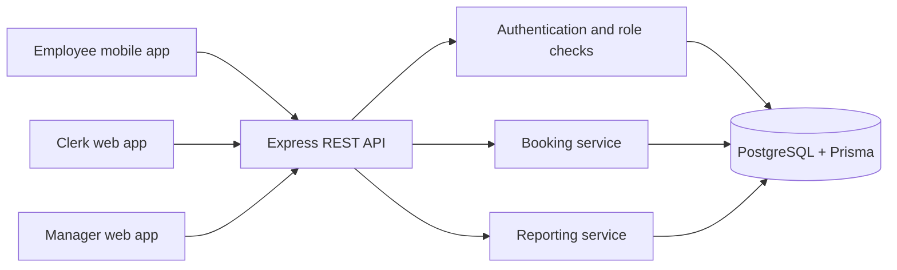
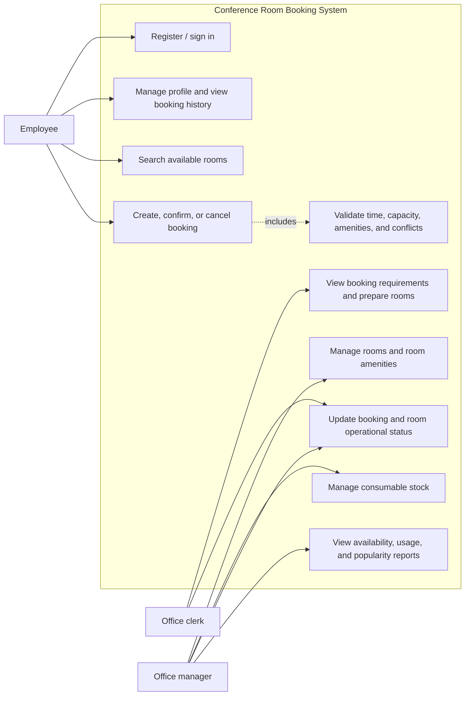
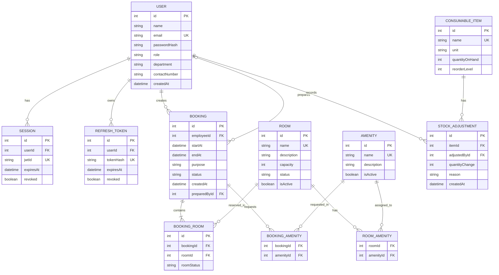

# Conference Room Booking System - Project Plan

## 1. Purpose and scope

This document turns the **Mini Project A** brief into an implementation plan for a conference room booking system for one office building. The solution will support a small business through:

- a web application for administration and reporting;
- a mobile-friendly application for employees to find and make bookings;
- a TypeScript/Express REST API and relational database; and
- role-based access for employees, office clerks, and office managers.

The system must support Create, Retrieve, Update, and Delete (CRUD) operations where appropriate, and all progress should be committed to the supplied Git repository.

## 2. Current project assessment

### What exists

The repository is currently an early API scaffold:

| Area | Current state | Reuse value |
| --- | --- | --- |
| README | Project title only | Replace with setup and run instructions. |
| API | TypeScript files for authentication middleware, controller, and JWT/password helpers | Good starting point for authentication. |
| Authentication | Signup, login, refresh, logout; hashed passwords; JWT sessions and refresh-token storage | Retain, then connect to the final role model and routes. |
| Database | Prisma is imported, and code assumes `user`, `worker`, `admin`, `session`, and `refreshToken` models | The Prisma schema, migration files, and database configuration are not present in the tracked files. |
| Client apps | No web or mobile application is present | Build both. |
| Booking domain | No rooms, amenities, bookings, stock, reporting, validation, routes, or tests are present | Build as the main feature set. |

### Important integration notes

1. Treat the existing authentication code as a scaffold, not a finished module. The signup destructuring syntax is invalid TypeScript and its error handler currently returns no response.
2. The current code creates a `worker` record for every account and an `admin` record only for the `admin` role. Replace this with the three project roles: `EMPLOYEE`, `CLERK`, and `MANAGER` (or keep `User.role` as the single source of role truth).
3. Create the missing Prisma schema and migrations before building feature controllers. The database relationships should be implemented first because every major feature depends on them.
4. Prevent booking collisions at the API/database layer; do not rely on the client interface alone.

## 3. Recommended solution shape



### Suggested technology choices

| Layer | Recommendation | Why |
| --- | --- | --- |
| API | Node.js, TypeScript, Express | Matches the existing code. |
| ORM/database | Prisma with PostgreSQL | Relational, migration-based, and suitable for bookings and reports. |
| Web | React + TypeScript (for clerk and manager screens) | Fast CRUD and reporting UI development. |
| Mobile | React Native + Expo | Shares TypeScript knowledge and gives a genuine mobile client. |
| API documentation | Swagger/OpenAPI or a maintained `docs/API.md` | Makes frontend and mobile integration predictable. |
| Testing | Vitest/Jest + Supertest | Test availability and authorization rules without a UI. |

If time is limited, build one responsive React web app first and use it as the mobile-friendly employee experience. Only call it a mobile application if it is packaged/tested as a mobile app (for example, React Native/Expo); a responsive website alone may not satisfy the brief's mobile-app requirement.

## 4. Roles and permissions

| Role | Main responsibilities | Key permissions |
| --- | --- | --- |
| Employee | Register, maintain profile, search rooms, create and view bookings | Manage own profile and own bookings; search availability; submit/cancel a booking before preparation. |
| Office clerk | Prepare rooms and close bookings | View all bookings, view required amenities, mark a booking `PREPARING`, `READY`, `COMPLETED`, or `CANCELLED`; return rooms to available. |
| Office manager | Manage the facilities and make decisions from reports | CRUD rooms and amenities, assign amenities, manage consumable stock, override room status, view availability/usage/popularity reports. |

## 5. Functional requirements mapped to features

| Brief requirement | Feature to implement | Minimum done condition |
| --- | --- | --- |
| Manage rooms | Room CRUD | Manager can create, list, edit, archive/delete and set the status of a room. |
| Room description, capacity, amenities | Room details and room-amenity assignment | A room shows its details and multiple amenities. |
| Consumable stock | Inventory CRUD and stock adjustments | Manager can set stock and record additions/usage with an auditable adjustment record. |
| Employee registration/profile | Account and profile module | Employee can register, sign in, edit department/contact details, and see booking history. |
| Search by date/time/capacity/amenities | Availability search endpoint and UI | Search returns only rooms that are active, available, large enough, amenity-compatible, and not time-overlapping. |
| One booking with multiple rooms | Booking header plus booking-room lines | An employee can select one or more compatible rooms in one booking request. |
| Clerk preparation | Booking workflow/status updates | Clerk can see each requested room and its amenities, then update booking status. |
| Manager information and reports | Dashboard/report endpoints | Show availability, usage count/hours, and popularity ranking by room/date range. |

## 6. Core business rules

1. A booking has one employee, one start date-time, one end date-time, and one or more requested rooms.
2. `endAt` must be after `startAt`; bookings may not be made in the past.
3. A room is selectable only if it is `AVAILABLE` and its capacity is at least the requested capacity.
4. A room matches requested amenities only when it has **every** requested amenity.
5. A room cannot have overlapping active booking lines. Two intervals overlap when `existing.startAt < requested.endAt` **and** `existing.endAt > requested.startAt`.
6. Confirming a multi-room booking must validate every selected room inside one database transaction. If one room is unavailable, create no booking.
7. A clerk can only prepare a confirmed booking. After the meeting, the clerk completes/cancels it and the room becomes available for future bookings.
8. Use a room `status` for operational state (`AVAILABLE`, `OUT_OF_SERVICE`, `MAINTENANCE`), not as the sole record of calendar availability. Calendar availability comes from booking-time overlap checks.
9. Do not delete completed bookings; preserve history. Prefer `archivedAt`/`isActive` for rooms and amenities where history needs preservation.

## 7. Use case diagram



## 8. Entity relationship design (ERD)



### Data-model decisions

- `BOOKING_ROOM` is essential: it supports the brief's requirement that one booking may include multiple rooms.
- `BOOKING_AMENITY` stores the amenities requested for the meeting, even if room assignments later change. This lets the clerk see exactly what was required.
- `ROOM_AMENITY` defines installed/available room amenities.
- `STOCK_ADJUSTMENT` gives meaningful stock history; updating `quantityOnHand` alone cannot explain who changed stock or why.
- Add unique composite keys for `ROOM_AMENITY(roomId, amenityId)` and `BOOKING_AMENITY(bookingId, amenityId)`.

## 9. Activity diagram - employee booking

```mermaid
flowchart TD
  start([Start]) --> login[Employee signs in]
  login --> criteria[Enter date, time, capacity, and desired amenities]
  criteria --> search[System searches active rooms]
  search --> compatible{Compatible rooms found?}
  compatible -- No --> revise[Show alternatives / revise criteria]
  revise --> criteria
  compatible -- Yes --> select[Select one or more rooms and enter purpose]
  select --> verify[API re-checks room status, amenities, capacity, and time conflicts]
  verify --> free{All selected rooms still free?}
  free -- No --> conflict[Return unavailable rooms]
  conflict --> search
  free -- Yes --> create[Create CONFIRMED booking and booking-room lines in one transaction]
  create --> notify[Booking appears in clerk work queue]
  notify --> confirmation[Show confirmation to employee]
  confirmation --> end([End])
```

## 10. Activity diagram - clerk preparation and completion

```mermaid
flowchart TD
  start([Start]) --> queue[Clerk opens confirmed booking queue]
  queue --> details[View rooms, time, purpose, and requested amenities]
  details --> prepare[Prepare rooms and required amenities]
  prepare --> ready[Set booking to READY]
  ready --> meeting[Meeting takes place]
  meeting --> complete[Set booking to COMPLETED]
  complete --> reset[Ensure each room is operationally AVAILABLE, unless maintenance/out of service]
  reset --> history[Keep booking in history for reporting]
  history --> end([End])
```

## 11. API plan

Use `/api/v1` and protect all non-authentication routes with the existing `authenticate` middleware. A route should also use a role guard.

| Area | Example endpoints | Roles |
| --- | --- | --- |
| Authentication | `POST /auth/register`, `POST /auth/login`, `POST /auth/refresh`, `POST /auth/logout` | Public / signed-in user |
| Profile | `GET /me`, `PATCH /me`, `GET /me/bookings` | Employee, Clerk, Manager |
| Room search | `GET /rooms/availability?startAt=&endAt=&capacity=&amenityIds=` | Signed-in user |
| Rooms | `GET /rooms`, `POST /rooms`, `GET /rooms/:id`, `PATCH /rooms/:id`, `DELETE /rooms/:id` | Manager for writes |
| Amenities | `GET /amenities`, `POST /amenities`, `PATCH /amenities/:id`, `DELETE /amenities/:id` | Manager for writes |
| Bookings | `POST /bookings`, `GET /bookings/:id`, `GET /bookings`, `PATCH /bookings/:id/cancel` | Employees create/manage own; clerk/manager view all |
| Booking workflow | `PATCH /bookings/:id/status` | Clerk and Manager |
| Inventory | `GET /consumables`, `POST /consumables`, `PATCH /consumables/:id`, `POST /consumables/:id/adjustments` | Manager |
| Reports | `GET /reports/availability`, `GET /reports/usage`, `GET /reports/popularity` | Manager |

### Availability query sketch

1. Start with active rooms where `status = AVAILABLE` and `capacity >= requestedCapacity`.
2. Keep rooms that contain every requested amenity.
3. Exclude rooms with a `BOOKING_ROOM` whose parent booking is active (`CONFIRMED`, `PREPARING`, `READY`) and whose time range overlaps the requested range.
4. Re-run this exact check in a transaction when `POST /bookings` is called.

## 12. UI screens

### Employee mobile app

- Sign up / sign in
- Profile and booking history
- Search filters: date, start time, end time, capacity, amenities
- Search results and room details
- Select multiple rooms, review, confirm, and cancel booking

### Clerk web app

- Booking queue with date/status filters
- Booking detail: rooms, times, employee, purpose, and required amenities
- Preparation checklist and status controls

### Manager web app

- Rooms list/form and amenity assignment
- Amenities list/form
- Consumable stock list and stock adjustment form
- Availability dashboard
- Usage and popularity reports with date-range filters

## 13. Delivery plan

| Phase | Deliverables | Completion evidence |
| --- | --- | --- |
| 1. Foundation | Folder structure, environment config, PostgreSQL, Prisma schema/migration, fixed authentication routes | A user can register, log in, and access a protected endpoint. |
| 2. Facilities CRUD | Rooms, amenities, room-amenity assignments, inventory and stock adjustments | Manager can perform each CRUD action and the data persists. |
| 3. Booking engine | Search, availability rules, multi-room booking transaction, employee history | Tests prove no double booking and all selected rooms are validated. |
| 4. Clerk workflow | Queue, booking detail, preparation/completion status changes | Clerk can process a complete booking lifecycle. |
| 5. Clients | React manager/clerk web screens and React Native/Expo employee app | Each role can complete its intended journey. |
| 6. Reporting and hardening | Availability/usage/popularity reports, validation, authorization, tests, documentation | Demo data, a polished README, and reproducible test/run steps. |

## 14. Suggested repository layout

```text
MKMMADI_2026_TYP/
  API/
    prisma/
      schema.prisma
      migrations/
    src/
      controllers/
      routes/
      services/
      middleware/
      validators/
      utils/
    tests/
  web/
  mobile/
  docs/
    PROJECT_PLAN.md
    API.md
  README.md
```

Move the current `API/src_ts` code into the chosen source directory only after the build configuration is in place; do not mix duplicate controller trees.

## 15. Testing checklist

- Registration rejects duplicate email and missing required details.
- Each role is rejected from endpoints it is not allowed to use.
- A manager can create/update/archive a room and assign amenities.
- Search excludes inactive, unavailable, too-small, non-matching, and time-conflicting rooms.
- A booking with two rooms succeeds only when both rooms are available.
- Two simultaneous requests cannot create an overlapping booking for the same room.
- A clerk can only update allowed booking transitions.
- Stock adjustment changes the balance and writes a history record.
- Reports count completed/active bookings correctly for a selected date range.
- Employee history returns only the authenticated employee's bookings.

## 16. First implementation sprint

Start in this order:

1. Create `API/package.json`, TypeScript/Express entry point, Prisma configuration, `.env.example`, and PostgreSQL database connection.
2. Define the ERD as Prisma models; run the first migration and seed three users, three rooms, amenities, and consumables.
3. Repair and wire the authentication scaffold into routes; add `EMPLOYEE`, `CLERK`, and `MANAGER` authorization guards.
4. Implement manager room/amenity CRUD, then availability search.
5. Implement `POST /bookings` as one transaction with overlap checking, followed by the employee booking history endpoint.

This sequence produces a demonstrable vertical slice early: a manager creates rooms, an employee finds and books them, and the database blocks conflicting bookings.

## 17. Decisions to confirm before coding

- Which RDBMS will you use? PostgreSQL is recommended.
- Does the course expect a native/packaged mobile application, or is a responsive progressive web app accepted? Use React Native/Expo unless the lecturer confirms otherwise.
- Will a booking be immediately `CONFIRMED`, or should it begin `PENDING` and require clerk approval? This plan follows the brief wording: employee confirms, then clerk is informed.
- Are consumables only recorded globally, or should each stock adjustment be linked to a specific room/booking? Start globally; add an optional `roomId`/`bookingId` to `STOCK_ADJUSTMENT` if per-room consumption is required.
